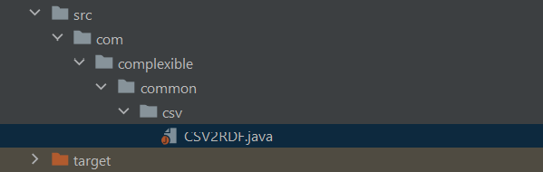
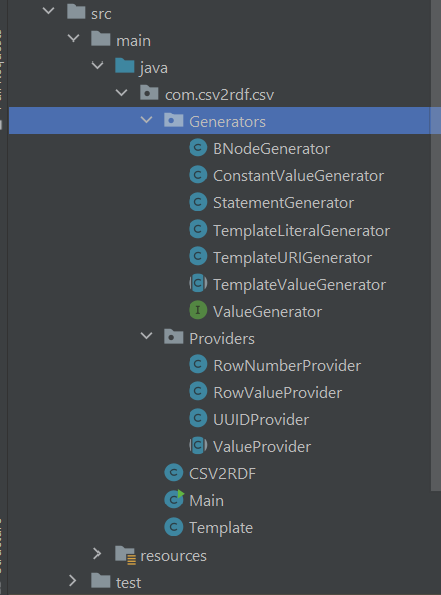

# Clean code - SonarLint

## Java osztályok külön fájlba szedése

A projekt az elején csak egy fájlból állt, benne az összes osztállyal, interface-el. Minden osztályt
és interface-t egy külön fájlba szedtünk szét, a könnyebb átláthatóság és az objektum orientált
elvek követése érdekében.

A külön fájlba szedés után, módosítani kellett néhány osztály, metódus és attribútum láthatóságán,
hogy a kód hiba nélkül lefusson.

## SonarLint hibák javítása

A SonarLintet a fejlesztőkörnyezetben tudtuk bővítményként telepíteni, ami után rögtön lefutottak az
ellenőrzések a fájlokra.

#### Hibák melyeket jelzett a SonarLint:

- Logger használata logolásra system.out.println helyett
- Attribútum név konvenciók követése
- Nem használt importok törlése

## Függvények rövidítése, osztályok külön packagebe szedése

A clean code elvek követése érdekében a túl hosszú metódusokat több rövid metódusba szedtünk szét. A
fájlok könnyebb átláthatósága miatt külön packagebe szedtük az egybe tartozó osztályokat.

#### Fájl szerkezet 
előtte:

utána:

