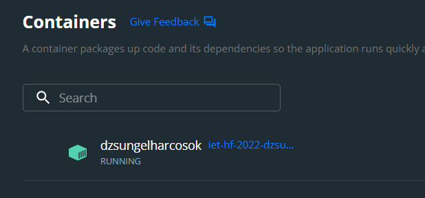
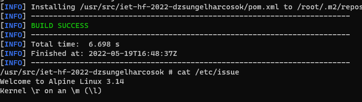

# Docker

A **[Docker](https://www.docker.com/)** egy számítógépes program, amely operációs rendszer szintű virtualizációt végez és konténerek futtatására szolgál.

A konténerek olyan imagefile-okból jönnek létre, amelyek pontos specifikációkat tartalmaznak. Az imagefile-ok gyakran standard image-ek kombinálásával és módosításával jönnek létre, amelyek szabadon elérhető repositorikból letölthetőek.

A Docker a következők miatt hasznos az aktuális projekt esetében:
- Nem szükséges a Maven telepítése saját eszközre
- Nem szükséges a Java telepítése saját eszközre, környezeti változók beállítása, megfelelő verzió ellenőrzése
- A projekt függőségei is közvetlenül a Docker konténerbe töltődnek le
- Egy parancs kiadásával előállnak a generált fájlok a megfelelő mappában a Docker konténerben.

A projekt esetében egy `openjdk:17-jdk-alpine` base image-t vettünk alapul, és a Dockerfile megfelelő konfigurálása után, illetve a segéd `.cmd` script elkészítése után előáll a sikeres Docker konténer deploy:
```
.\build.cmd src/main/resources/input/examples/cars/template.ttl src/main/resources/input/examples/cars/cars.csv src/main/resources/output/cars.ttl
```



Természetesen a Maven-es parancsok ugyanúgy futtathatóak a konténerben, mint a saját gépünkön.




