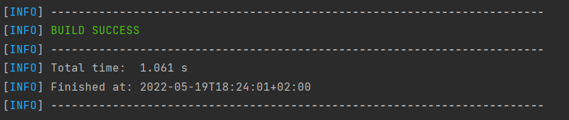

# Maven

A **[Maven](http://maven.apache.org/)** egy projekt szoftver menedzsment rendszer, melyet például a build folyamat automatizálására lehet használni.


Az aktuális projekt esetében szükség volt az **Apache Ant** build keretrendszer lecserélésére és az **Apache Maven** beimportálására a projektbe.

A **Maven** beüzemelése után törölhető volt a felesleges `lib` mappa (ahogyan a `.jar` fájlok is), mely tartalmazta a projekt függőségeit, helyette egyszerűen felsorolhattuk őket a projekt `pom.xml` fájlában.

A Maven dinamikusan is le tud tölteni függőségeket / komponenseket a különböző hostok **repository**-jából, ezért nagyon sok korábbi függősének verziót is lehetett emelni.

A keretrendszer beüzemelése után az összes Maven lifecycle futattása roppant egyszerűvé válik, így a buildelés és futattás is.
 
###  Buildelés
A következő paranccsal tudjuk buildelni a projektet:
```
mvn clean install
```
### Futtatás:
A buildelés után pedig futtathatjuk a projektet az `mvn exec:java` paranccsal és az argumentumokkal:

```
mvn exec:java -Dexec.args="<templateFile> <csvFile> <outputFile>" 
```

Például a következő paranccsal és argumentumokkal tudjuk futtatni a projektet:
```
mvn exec:java -Dexec.args="src/main/resources/input/examples/cars/template.ttl src/main/resources/input/examples/cars/cars.csv src/main/resources/output/cars.ttl" 
``` 

Sikeres futattás után a következő fogad minket: 

