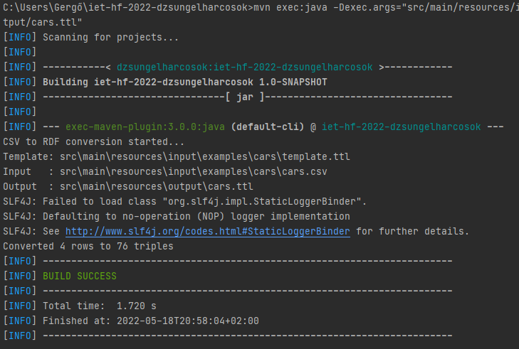
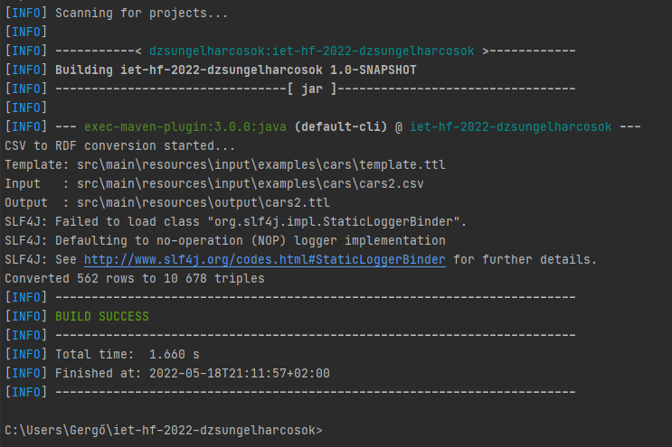
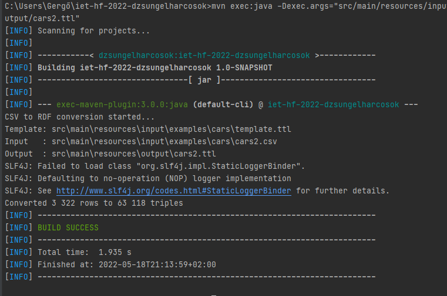
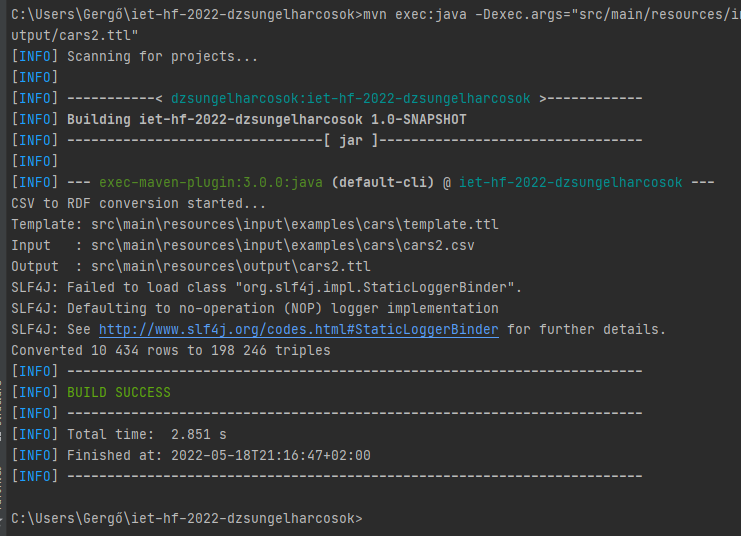
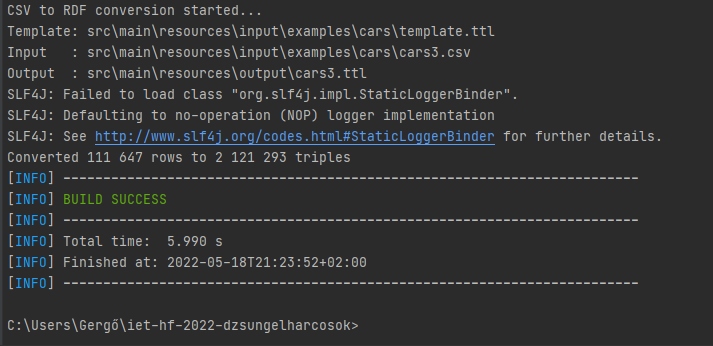
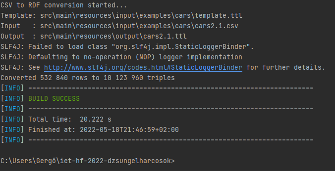
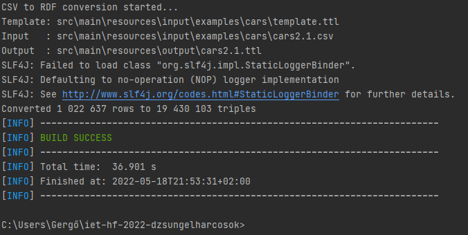
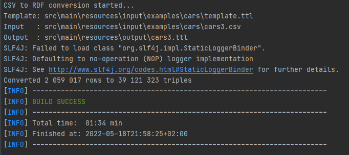
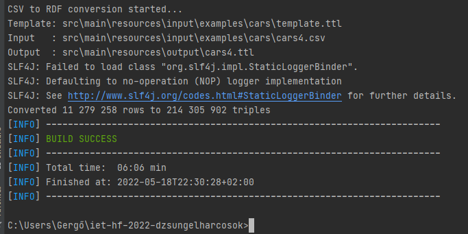

# Stressz Teszt Dokumentáció
## Alkalmazás futtatása
- A stressz teszt első lépéseként az alkalmazást a megadott példaadatokkal futtattuk. A futtatáshoz kiadott parancs: 
```
mvn exec:java -Dexec.args="src/main/resources/input/examples/cars/template.ttl src/main/resources/input/examples/cars/cars.csv src/main/resources/output/cars.ttl" 
```

- A kimenetben látható, hogy a 4 sort körülbelül 1,72 másodperc alatt konvertálta az alkalmazás.


## Az első stressz tesztek 
- Ahhoz, hogy meggyőződhessünk róla, hogy a program nagy adatmennyiséggel is képes megfelelően működni megsokszoroztuk a beviteli sorok számát, majd újra lefuttattuk az alkalmazást. Mivel kismértékben változó a program lefutási ideje, ezért előfordult, hogy több sort kevesebb idő alatt dolgozott fel.

    Ez a jelenség még 500 sor felett is még megfigyelhető volt, ahogy a lenti ábra is mutatja:
    

- Az első egyértelműen kimutatható eredmények a 3000-es nagyságrendben jelentkeztek. Itt az alkalmazásnak már 1,9 másodpercbe telt feldolgoznia az adatokat. 
    

## A számok növelése
- Az első tesztekből világosan látszódott, hogy ha látványosabb változásokat szeretnénk elérni, a sorok számát nagyságrendekkel kell növelnünk. A következő tesztet már 10.000 sorra futtattuk le és 2,8 másodpercet vett igénybe.

- Amikor megtízszereztük, vagyis 100.000 sorra növeltük a bemenetet, a futási idő csupán a kétszeresére nőtt.

A teszteket megismételtük többször is a százezres nagyságrendben köztük 500.000 sornál is, ahol a lefutás már 20 másodpercig tartott.

- Egy millió sornál az alkalmazás már több mint fél percig dolgozta fel az adatokat és kétmilió sornál ez az idő másfél percre nőtt.


- A legnagyobb bemenet amivel az alkalmazást teszteltük az 11 millió sor volt. Ezek konvertálása kicsivel több mint 6 percet vett igénybe.

## Konklúzió
Az alkamazást alapos stressz tesztelésnek vetettük alá, aminek során nagyságrendekkel több adatot szolgáltattunk a bemenetére mint amire tervezve lett. Természetesen az  alkalmazásnak így több időbe telt lefutni, de minden alkalommal befejezte feladatát, így sikeresen teljesítette a stressz tesztet.